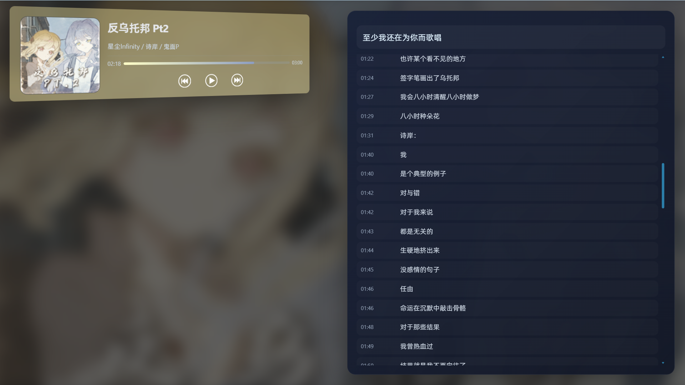
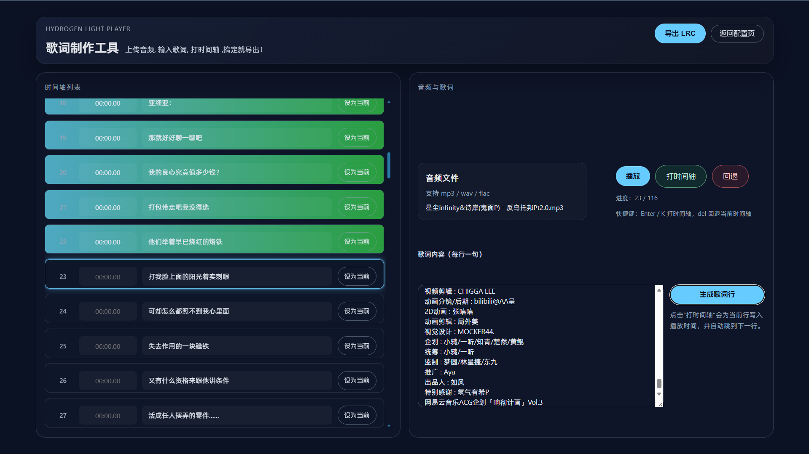
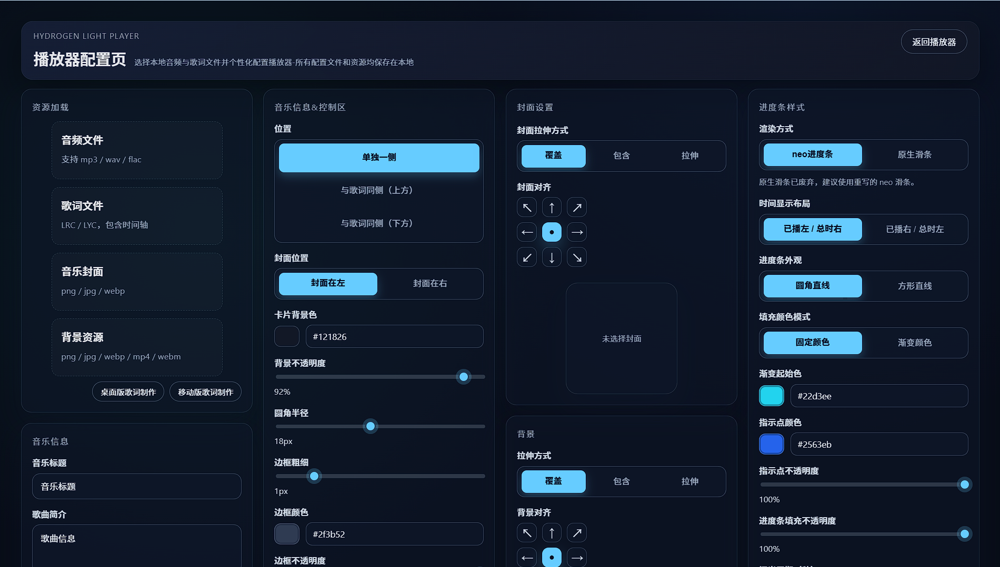

# Hydrogen Light Player

一款使用 Vue 3 和 Vite 构建的**现代化、轻量级**音乐播放器。
大量可自定义的配置，包括卡片、进度条、封面等，也支持3D效果。

前往：https://player.YunHydrogen.top

## 🎯功能特点

- 📝 **lrc歌词制作**：可以手动导入歌词，打时间轴并且具有流畅的反馈动画，适配 [桌面端](https://player.yunhydrogen.top/#/lrcmake) 和 [移动端](https://player.yunhydrogen.top/#/lrcmakemobile) ，并且可以导出lrc文件(通用)。

-  🎉 **高度自定义的播放器**：大量可自定义的配置，包括卡片、进度条、封面等，也支持支持3D效果。~~（开发这个的目的就是因为我不会AE）~~

- 📤 **轻量化**：一个不到1MB的html即可本地运行 ~~大头全在浏览器上~~

## 📷效果预览

🎵播放器

🎼歌词制作

🛠️配置界面

> 图片里的音乐：https://www.bilibili.com/video/BV1nV6ZBcEyH/ 

## 🔦使用的技术

- [Vue 3](https://v3.vuejs.org/) - 渐进式 JavaScript 框架
- [Vite](https://vitejs.dev/) - 下一代前端构建工具

## 📝许可证

该项目根据 GNU Affero 通用公共许可证第 3.0 版 (AGPL-3.0) 授权。

详情请参见 [LICENSE](./LICENSE) 文件。

**AGPL-3.0 许可证确保：**
- 源代码始终保持免费可用
- 任何修改也必须在相同许可证下分发，且网络使用视为分发，这意味着使用此代码的服务也必须提供源代码访问权限
- 用户有权运行、研究、共享和修改软件

## 🪪联系方式

项目链接: [Github](https://github.com/Yun-Hydrogen/hydrogen_lightplayer)

## 📆TO DOS
**❇️即将实现**
- [ ] 音乐封面加载gif
- [ ] 歌词面板多样式
- [ ] 歌词面板3D化

